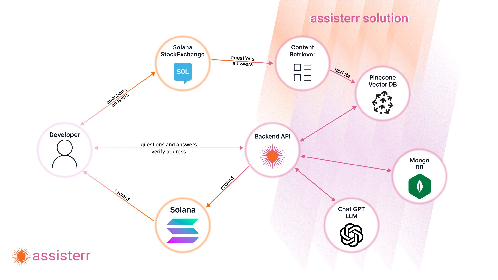

# Solana Renaissance Global Online Hackathon 2024
Repository for Assisterr's implementation of solution for Solana Renaissance Global Online Hackathon 2024

More information about the Solana Renaissance Global Online Hackathon 2024 can be found here: https://www.colosseum.org/renaissance

Link to functional application: https://frontend.solana2024.assisterr.ai/

**Intro**

Our solution is a incentive-driven framework that lays **at the intersection of AI, Web3, and DevTooling** and can be used to incentivize the creation of community-owned AI models.

**Problem**

Developers often struggle to get timely support while building and often ask questions on StackOverflow. This can be a solution, but there is a lack of incentive to provide the answers and evaluate its quality by other contributors.

Over the last year, LLMs have empowered real-time conversational chatbot support, but the problem is getting updates regularly. We aim to solve this by incentivizing regular data inference.

To tackle this challenge, we have built an incentive-driven framework that encourages the community to contribute by answering questions at the StackExchange-style interface.

**Overview**

Developers can pose questions on the Solana StackExchange, seeking assistance or guidance for Solana development. The Content Retriever then automatically fetches relevant data from the subforum and stores it in the Pinecone Vector Database. Developers can interact with our Backend AI, initiating a Retrieval Augmented Generation (RAG) process. This involves querying the Pinecone Vector Database for similar topics and engaging with the Large Language Model (LLM), powered by Chat GPT 4, to generate comprehensive answers. As a token of appreciation for contributions, developers who provide answers on platforms like Solana StackExchange or Stack Overflow are eligible for rewards. To claim rewards, developers simply need to submit address verification by signing a message using their Solana Wallet. Anybody can ask questions, contribute answers, and claim rewards to enrich the developer's content.

**Our framework consists from:**

-  **Rewarding Mechanism** - We have designed a reward mechanism to incentivize valuable contributions and their validation by the community. For the Hackathon, a address verification procedure for the purpose of rewards claiming process. If a developer wants to claim rewards, he must submit a Proof of Account. That means he needs to prove that he is the owner of the StackOverlow account. That can be done by putting a code in the About section of his StackOverflow account. After that, he would need to provide his address on which rewards would be sent. To do it, he needs to pass the Proof of Wallet procedure by signing his StackOverflow user_id with his Solana Wallet. 

-  **AI Infrastructure Layer** - The AI part of our solution utilizes the RAG model. Which provides efficient data inference compared to model finetuning. The retriever component is the Pinecone Vector Database, where every vector is a scraped question/answer pair from StackOverflow's "near protocol" tag. Content is categorized by topic/area/programming language and inserted in a database. That also enables provable training functionality, since every vector represents a traceable content chunk. When a developer asks a question, a similarity search is performed on a vector database where question/answer semantics are taken into consideration. With the most similar answers, LLM (ChatGPT 4.0) is poked to structure a fine answer to the developer.

-  **Leaderboard** - In order to review who is the biggest contributor to Solana StackExchange, a Leaderboard has been created to review the contributions from different aspects. Those aspects include the ones who asked questions, gave answers and have had the most up votes.

